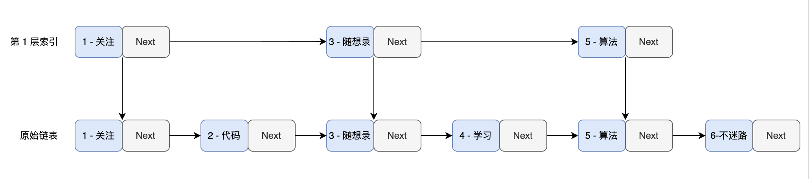

# 存储引擎项目结构
项目整体上拥有一个 skiplist.h 文件,拥有两个核心类：

Node 类

SkipList 类

Node 类是存储引擎中用于存放实际数据的类，而 SkipList 则对外提供了组织，访问，操作 Node 类的功能。

# 跳表简介
“跳跃列表是在很多应用中有可能替代平衡树而作为实现方法的一种数据结构。跳跃列表的算法有同平衡树一样的渐进的预期时间边界，并且更简单、更快速和使用更少的空间。”

在 Redis 中，跳表被用于实现有序集合（sorted sets）数据类型，这主要是因为跳表在处理有序数据时可以提供良好的性能，尤其是在插入、删除和搜索操作上。
## 从链表到跳表
链表是有序的

为了提高查找效率，我们采取了一种独特的策略：从原链表中选取关键节点作为索引层。这些被选出的节点形成了一个新的，较原链表更为简短的链表。

由于原链表本身是有序的，索引层中的节点也同样保持有序，利用这个有序性，我们能够加快查找速度。
## 两种遍历方式
在传统的单链表中，我们需要从头至尾逐个检查节点。例如，我们首先比较 key = 1 的节点，发现它小于 6，然后继续比较 key = 2 的节点，如此循环。
 
在跳表中，我们首先检查第一层索引，比较 key = 1 的节点后，可以直接跳到 key = 3 的节点，因为 6 大于 3，我们再跳到 key = 5 的节点。
在这个过程中，我们省略了与 key = 2 和 key = 4 的节点的比较，但实际上，通过与 key = 3 和 key = 5 的比较，我们已经间接地排除了它们。
（类似于二分查找）

# 节点搜索
开始于顶层索引：首先定位到跳表最顶层索引的首个节点

水平遍历：从最顶层的首个节点开始向右遍历。如果当前节点的下一个节点的值小于或等于待查找的值，表明该节点左侧的所有节点都小于或等于待查找值，此时跳转到下一个节点

下沉操作：若当前节点的下一个节点的值大于待查找值，意味着所需查找的节点位于当前位置左侧的某处，此时执行下沉操作，即向下移动到较低层的同一位置

重复查找与下沉：继续执行第二步和第三步的操作，直到到达最底层链表。在此层继续向右移动，直到找到目标节点或达到链表末端

# 节点插入
1.插入前找到应插入元素的位置，以维护有序性。

2.然而，如果我们持续向跳表中添加数据，而忽视对索引的更新，这将导致跳表效率的显著退化。在最极端的情况下，这种效率下降甚至可能使跳表的查询效率降至 O(n)，与普通链表的查询效率相当。

一种可能的思路是，在每次插入新节点时，删除所有现有索引，并从每两个节点中抽取一个作为新索引，再逐层执行此操作。虽然这个方法概念上简单，但实际上它效率低下，并且实现起来相当复杂。

理想情况下，在原始链表中，我们每隔一个节点选择一个作为上层的索引。然后，把这一层的索引视为新的基础链表，重复同样的选择过程，直到顶层索引仅包含两个节点。

所以，我们可以在节点插入的时候，就通过某种随机分层机制，确定它所在的层级。

```c++
    int randomLevel() {
        int level = 1;
        while (random() % 2) {
            level++;
        }
        return level;
    }
```
# 删除


